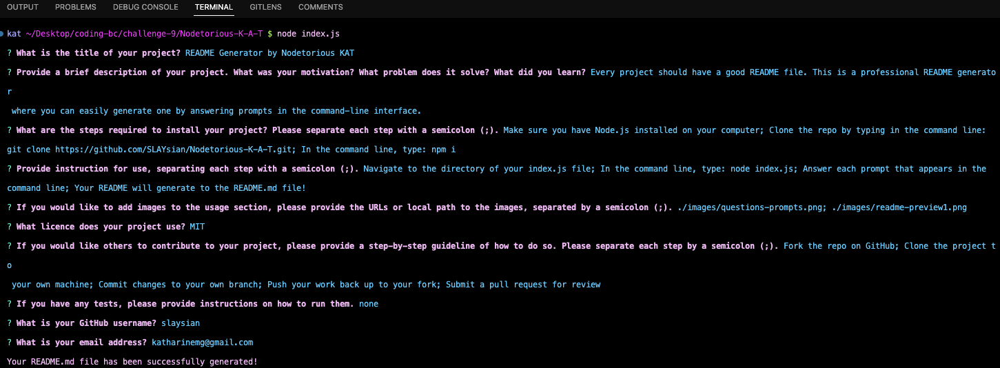
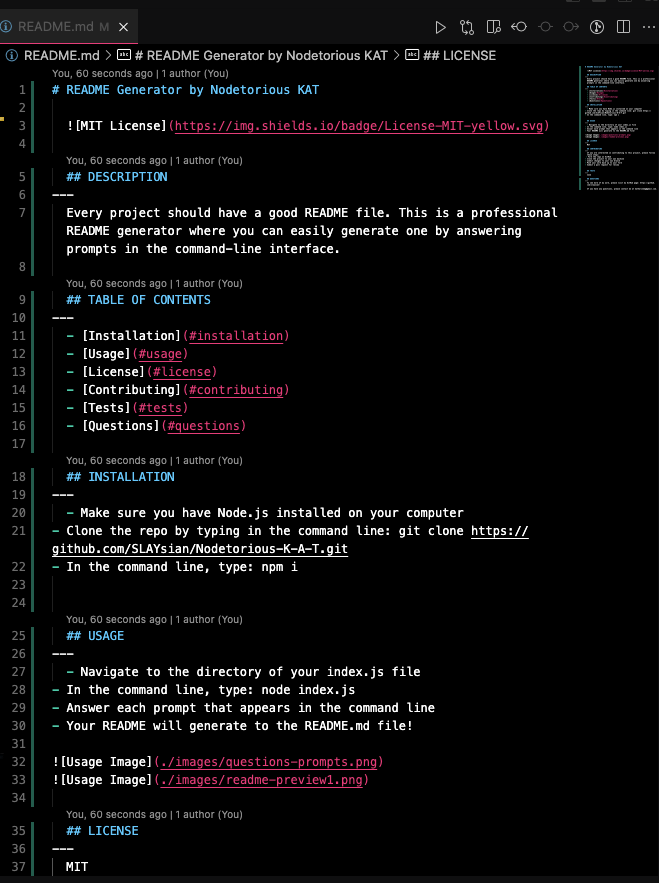
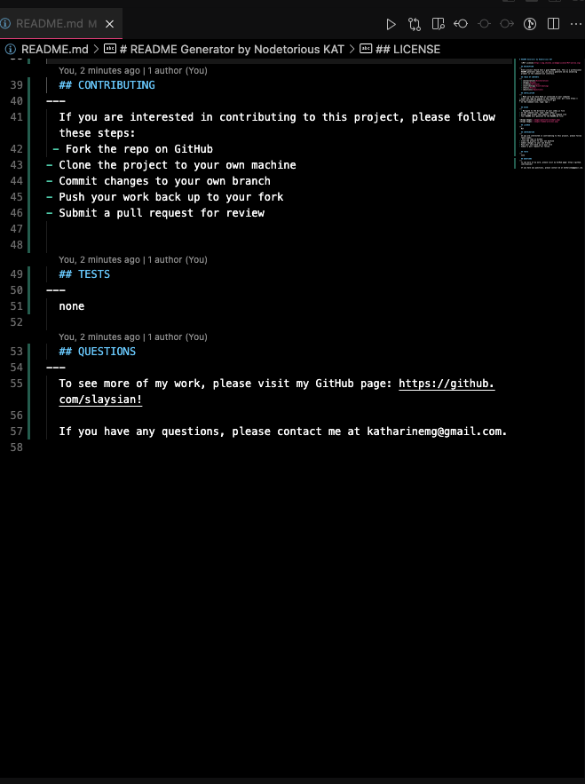
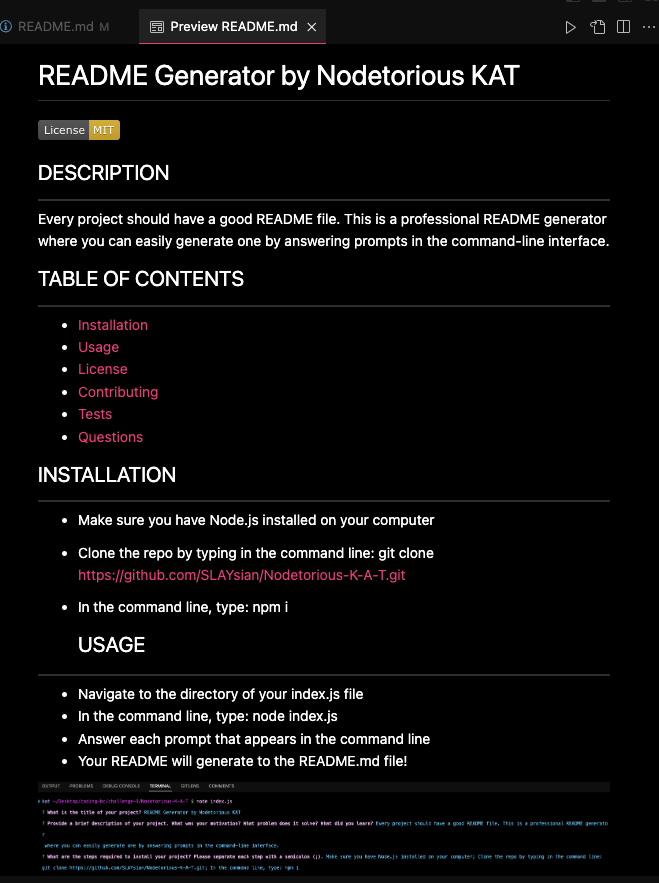
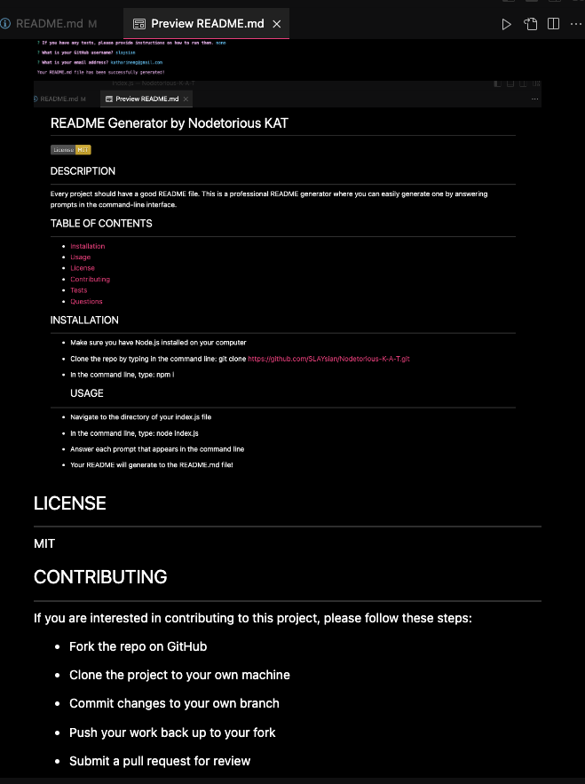
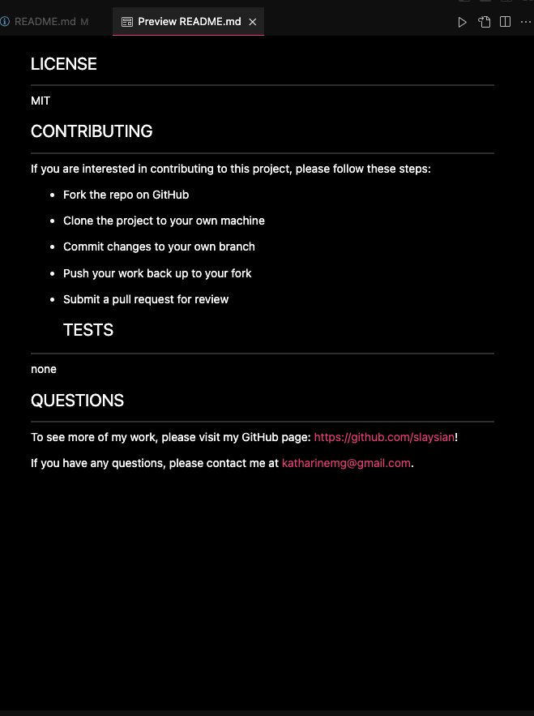

# README Generator by Nodetorious KAT
  
  

  ## DESCRIPTION
---
  Every project should have a good README file. This is a professional README generator where you can easily generate one by answering prompts in the command-line interface.
  
  ## TABLE OF CONTENTS
---
  - [Installation](#installation)
  - [Usage](#usage)
  - [License](#license)
  - [Contributing](#contributing)
  - [Tests](#tests)
  - [Questions](#questions)

  ## INSTALLATION
---
  - Make sure you have Node.js installed on your computer
- Clone the repo by typing in the command line: git clone https://github.com/SLAYsian/Nodetorious-K-A-T.git
- In the command line, type: npm i

  
  ## USAGE
---
  - Navigate to the directory of your index.js file
- In the command line, type: node index.js
- Answer each prompt that appears in the command line
- Your README will generate to the SAMPLE.md file!

  ## LICENSE
---
  MIT

  ## CONTRIBUTING
---
  If you are interested in contributing to this project, please follow these steps:
 - Fork the repo on GitHub
- Clone the project to your own machine
- Commit changes to your own branch
- Push your work back up to your fork
- Submit a pull request for review

  ## TESTS
---
  none

  ## QUESTIONS
---
  To see more of my work, please visit my GitHub page: https://github.com/slaysian

  If you have any questions, please contact me at katharinemg@gmail.com
  